# slcgen

The `slcgen` python script generates FontForge SFD files containing 800+
algorithmically-generated glyphs, mostly in the Box Drawing, Block Elements,
Symbols for Legacy Computing, and Symbols for Legacy Computing Supplement
blocks, from a small set of parameters, most of which are optional.
It is intended to be used by developers of fonts and font software
who would like to support these characters.

## Parameters passed to slcgen

TBD

## Glyphs generated by slcgen

<table>
<tr><td></td><td>U+0020</td><td>SPACE</td></tr>
<tr><td></td><td>U+00A0</td><td>NO-BREAK SPACE</td></tr>
<tr><td></td><td>U+23B8</td><td>LEFT VERTICAL BOX LINE</td></tr>
<tr><td></td><td>U+23B9</td><td>RIGHT VERTICAL BOX LINE</td></tr>
<tr><td></td><td>U+23BA</td><td>HORIZONTAL SCAN LINE-1</td></tr>
<tr><td></td><td>U+23BB</td><td>HORIZONTAL SCAN LINE-3</td></tr>
<tr><td></td><td>U+23BC</td><td>HORIZONTAL SCAN LINE-7</td></tr>
<tr><td></td><td>U+23BD</td><td>HORIZONTAL SCAN LINE-9</td></tr>
<tr><td></td><td>U+2500</td><td>BOX DRAWINGS LIGHT HORIZONTAL</td></tr>
<tr><td></td><td>U+2501</td><td>BOX DRAWINGS HEAVY HORIZONTAL</td></tr>
<tr><td></td><td>U+2502</td><td>BOX DRAWINGS LIGHT VERTICAL</td></tr>
<tr><td></td><td>U+2503</td><td>BOX DRAWINGS HEAVY VERTICAL</td></tr>
<tr><td></td><td>U+2504</td><td>BOX DRAWINGS LIGHT TRIPLE DASH HORIZONTAL</td></tr>
<tr><td></td><td>U+2505</td><td>BOX DRAWINGS HEAVY TRIPLE DASH HORIZONTAL</td></tr>
<tr><td></td><td>U+2506</td><td>BOX DRAWINGS LIGHT TRIPLE DASH VERTICAL</td></tr>
<tr><td></td><td>U+2507</td><td>BOX DRAWINGS HEAVY TRIPLE DASH VERTICAL</td></tr>
<tr><td></td><td>U+2508</td><td>BOX DRAWINGS LIGHT QUADRUPLE DASH HORIZONTAL</td></tr>
<tr><td></td><td>U+2509</td><td>BOX DRAWINGS HEAVY QUADRUPLE DASH HORIZONTAL</td></tr>
<tr><td></td><td>U+250A</td><td>BOX DRAWINGS LIGHT QUADRUPLE DASH VERTICAL</td></tr>
<tr><td></td><td>U+250B</td><td>BOX DRAWINGS HEAVY QUADRUPLE DASH VERTICAL</td></tr>
<tr><td></td><td>U+250C</td><td>BOX DRAWINGS LIGHT DOWN AND RIGHT</td></tr>
<tr><td></td><td>U+250D</td><td>BOX DRAWINGS DOWN LIGHT AND RIGHT HEAVY</td></tr>
<tr><td></td><td>U+250E</td><td>BOX DRAWINGS DOWN HEAVY AND RIGHT LIGHT</td></tr>
<tr><td></td><td>U+250F</td><td>BOX DRAWINGS HEAVY DOWN AND RIGHT</td></tr>
<tr><td></td><td>U+2510</td><td>BOX DRAWINGS LIGHT DOWN AND LEFT</td></tr>
<tr><td></td><td>U+2511</td><td>BOX DRAWINGS DOWN LIGHT AND LEFT HEAVY</td></tr>
<tr><td></td><td>U+2512</td><td>BOX DRAWINGS DOWN HEAVY AND LEFT LIGHT</td></tr>
<tr><td></td><td>U+2513</td><td>BOX DRAWINGS HEAVY DOWN AND LEFT</td></tr>
<tr><td></td><td>U+2514</td><td>BOX DRAWINGS LIGHT UP AND RIGHT</td></tr>
<tr><td></td><td>U+2515</td><td>BOX DRAWINGS UP LIGHT AND RIGHT HEAVY</td></tr>
<tr><td></td><td>U+2516</td><td>BOX DRAWINGS UP HEAVY AND RIGHT LIGHT</td></tr>
<tr><td></td><td>U+2517</td><td>BOX DRAWINGS HEAVY UP AND RIGHT</td></tr>
<tr><td></td><td>U+2518</td><td>BOX DRAWINGS LIGHT UP AND LEFT</td></tr>
<tr><td></td><td>U+2519</td><td>BOX DRAWINGS UP LIGHT AND LEFT HEAVY</td></tr>
<tr><td></td><td>U+251A</td><td>BOX DRAWINGS UP HEAVY AND LEFT LIGHT</td></tr>
<tr><td></td><td>U+251B</td><td>BOX DRAWINGS HEAVY UP AND LEFT</td></tr>
<tr><td></td><td>U+251C</td><td>BOX DRAWINGS LIGHT VERTICAL AND RIGHT</td></tr>
<tr><td>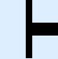</td><td>U+251D</td><td>BOX DRAWINGS VERTICAL LIGHT AND RIGHT HEAVY</td></tr>
<tr><td>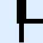</td><td>U+251E</td><td>BOX DRAWINGS UP HEAVY AND RIGHT DOWN LIGHT</td></tr>
<tr><td></td><td>U+251F</td><td>BOX DRAWINGS DOWN HEAVY AND RIGHT UP LIGHT</td></tr>
<tr><td></td><td>U+2520</td><td>BOX DRAWINGS VERTICAL HEAVY AND RIGHT LIGHT</td></tr>
<tr><td></td><td>U+2521</td><td>BOX DRAWINGS DOWN LIGHT AND RIGHT UP HEAVY</td></tr>
<tr><td></td><td>U+2522</td><td>BOX DRAWINGS UP LIGHT AND RIGHT DOWN HEAVY</td></tr>
<tr><td></td><td>U+2523</td><td>BOX DRAWINGS HEAVY VERTICAL AND RIGHT</td></tr>
<tr><td></td><td>U+2524</td><td>BOX DRAWINGS LIGHT VERTICAL AND LEFT</td></tr>
<tr><td></td><td>U+2525</td><td>BOX DRAWINGS VERTICAL LIGHT AND LEFT HEAVY</td></tr>
<tr><td></td><td>U+2526</td><td>BOX DRAWINGS UP HEAVY AND LEFT DOWN LIGHT</td></tr>
<tr><td></td><td>U+2527</td><td>BOX DRAWINGS DOWN HEAVY AND LEFT UP LIGHT</td></tr>
<tr><td></td><td>U+2528</td><td>BOX DRAWINGS VERTICAL HEAVY AND LEFT LIGHT</td></tr>
<tr><td></td><td>U+2529</td><td>BOX DRAWINGS DOWN LIGHT AND LEFT UP HEAVY</td></tr>
<tr><td></td><td>U+252A</td><td>BOX DRAWINGS UP LIGHT AND LEFT DOWN HEAVY</td></tr>
<tr><td></td><td>U+252B</td><td>BOX DRAWINGS HEAVY VERTICAL AND LEFT</td></tr>
<tr><td></td><td>U+252C</td><td>BOX DRAWINGS LIGHT DOWN AND HORIZONTAL</td></tr>
<tr><td></td><td>U+252D</td><td>BOX DRAWINGS LEFT HEAVY AND RIGHT DOWN LIGHT</td></tr>
<tr><td></td><td>U+252E</td><td>BOX DRAWINGS RIGHT HEAVY AND LEFT DOWN LIGHT</td></tr>
<tr><td></td><td>U+252F</td><td>BOX DRAWINGS DOWN LIGHT AND HORIZONTAL HEAVY</td></tr>
<tr><td></td><td>U+2530</td><td>BOX DRAWINGS DOWN HEAVY AND HORIZONTAL LIGHT</td></tr>
<tr><td></td><td>U+2531</td><td>BOX DRAWINGS RIGHT LIGHT AND LEFT DOWN HEAVY</td></tr>
<tr><td></td><td>U+2532</td><td>BOX DRAWINGS LEFT LIGHT AND RIGHT DOWN HEAVY</td></tr>
<tr><td></td><td>U+2533</td><td>BOX DRAWINGS HEAVY DOWN AND HORIZONTAL</td></tr>
<tr><td></td><td>U+2534</td><td>BOX DRAWINGS LIGHT UP AND HORIZONTAL</td></tr>
<tr><td></td><td>U+2535</td><td>BOX DRAWINGS LEFT HEAVY AND RIGHT UP LIGHT</td></tr>
<tr><td></td><td>U+2536</td><td>BOX DRAWINGS RIGHT HEAVY AND LEFT UP LIGHT</td></tr>
<tr><td></td><td>U+2537</td><td>BOX DRAWINGS UP LIGHT AND HORIZONTAL HEAVY</td></tr>
<tr><td></td><td>U+2538</td><td>BOX DRAWINGS UP HEAVY AND HORIZONTAL LIGHT</td></tr>
<tr><td></td><td>U+2539</td><td>BOX DRAWINGS RIGHT LIGHT AND LEFT UP HEAVY</td></tr>
<tr><td></td><td>U+253A</td><td>BOX DRAWINGS LEFT LIGHT AND RIGHT UP HEAVY</td></tr>
<tr><td></td><td>U+253B</td><td>BOX DRAWINGS HEAVY UP AND HORIZONTAL</td></tr>
<tr><td></td><td>U+253C</td><td>BOX DRAWINGS LIGHT VERTICAL AND HORIZONTAL</td></tr>
<tr><td></td><td>U+253D</td><td>BOX DRAWINGS LEFT HEAVY AND RIGHT VERTICAL LIGHT</td></tr>
<tr><td></td><td>U+253E</td><td>BOX DRAWINGS RIGHT HEAVY AND LEFT VERTICAL LIGHT</td></tr>
<tr><td></td><td>U+253F</td><td>BOX DRAWINGS VERTICAL LIGHT AND HORIZONTAL HEAVY</td></tr>
<tr><td></td><td>U+2540</td><td>BOX DRAWINGS UP HEAVY AND DOWN HORIZONTAL LIGHT</td></tr>
<tr><td></td><td>U+2541</td><td>BOX DRAWINGS DOWN HEAVY AND UP HORIZONTAL LIGHT</td></tr>
<tr><td></td><td>U+2542</td><td>BOX DRAWINGS VERTICAL HEAVY AND HORIZONTAL LIGHT</td></tr>
<tr><td>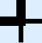</td><td>U+2543</td><td>BOX DRAWINGS LEFT UP HEAVY AND RIGHT DOWN LIGHT</td></tr>
<tr><td>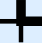</td><td>U+2544</td><td>BOX DRAWINGS RIGHT UP HEAVY AND LEFT DOWN LIGHT</td></tr>
<tr><td></td><td>U+2545</td><td>BOX DRAWINGS LEFT DOWN HEAVY AND RIGHT UP LIGHT</td></tr>
<tr><td></td><td>U+2546</td><td>BOX DRAWINGS RIGHT DOWN HEAVY AND LEFT UP LIGHT</td></tr>
<tr><td></td><td>U+2547</td><td>BOX DRAWINGS DOWN LIGHT AND UP HORIZONTAL HEAVY</td></tr>
<tr><td>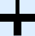</td><td>U+2548</td><td>BOX DRAWINGS UP LIGHT AND DOWN HORIZONTAL HEAVY</td></tr>
<tr><td></td><td>U+2549</td><td>BOX DRAWINGS RIGHT LIGHT AND LEFT VERTICAL HEAVY</td></tr>
<tr><td></td><td>U+254A</td><td>BOX DRAWINGS LEFT LIGHT AND RIGHT VERTICAL HEAVY</td></tr>
<tr><td></td><td>U+254B</td><td>BOX DRAWINGS HEAVY VERTICAL AND HORIZONTAL</td></tr>
<tr><td></td><td>U+254C</td><td>BOX DRAWINGS LIGHT DOUBLE DASH HORIZONTAL</td></tr>
<tr><td></td><td>U+254D</td><td>BOX DRAWINGS HEAVY DOUBLE DASH HORIZONTAL</td></tr>
<tr><td></td><td>U+254E</td><td>BOX DRAWINGS LIGHT DOUBLE DASH VERTICAL</td></tr>
<tr><td></td><td>U+254F</td><td>BOX DRAWINGS HEAVY DOUBLE DASH VERTICAL</td></tr>
<tr><td></td><td>U+2550</td><td>BOX DRAWINGS DOUBLE HORIZONTAL</td></tr>
<tr><td></td><td>U+2551</td><td>BOX DRAWINGS DOUBLE VERTICAL</td></tr>
<tr><td></td><td>U+2552</td><td>BOX DRAWINGS DOWN SINGLE AND RIGHT DOUBLE</td></tr>
<tr><td>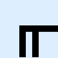</td><td>U+2553</td><td>BOX DRAWINGS DOWN DOUBLE AND RIGHT SINGLE</td></tr>
<tr><td></td><td>U+2554</td><td>BOX DRAWINGS DOUBLE DOWN AND RIGHT</td></tr>
<tr><td></td><td>U+2555</td><td>BOX DRAWINGS DOWN SINGLE AND LEFT DOUBLE</td></tr>
<tr><td>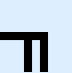</td><td>U+2556</td><td>BOX DRAWINGS DOWN DOUBLE AND LEFT SINGLE</td></tr>
<tr><td></td><td>U+2557</td><td>BOX DRAWINGS DOUBLE DOWN AND LEFT</td></tr>
<tr><td></td><td>U+2558</td><td>BOX DRAWINGS UP SINGLE AND RIGHT DOUBLE</td></tr>
<tr><td></td><td>U+2559</td><td>BOX DRAWINGS UP DOUBLE AND RIGHT SINGLE</td></tr>
<tr><td></td><td>U+255A</td><td>BOX DRAWINGS DOUBLE UP AND RIGHT</td></tr>
<tr><td></td><td>U+255B</td><td>BOX DRAWINGS UP SINGLE AND LEFT DOUBLE</td></tr>
<tr><td></td><td>U+255C</td><td>BOX DRAWINGS UP DOUBLE AND LEFT SINGLE</td></tr>
<tr><td></td><td>U+255D</td><td>BOX DRAWINGS DOUBLE UP AND LEFT</td></tr>
<tr><td>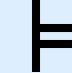</td><td>U+255E</td><td>BOX DRAWINGS VERTICAL SINGLE AND RIGHT DOUBLE</td></tr>
<tr><td></td><td>U+255F</td><td>BOX DRAWINGS VERTICAL DOUBLE AND RIGHT SINGLE</td></tr>
<tr><td>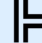</td><td>U+2560</td><td>BOX DRAWINGS DOUBLE VERTICAL AND RIGHT</td></tr>
<tr><td></td><td>U+2561</td><td>BOX DRAWINGS VERTICAL SINGLE AND LEFT DOUBLE</td></tr>
<tr><td></td><td>U+2562</td><td>BOX DRAWINGS VERTICAL DOUBLE AND LEFT SINGLE</td></tr>
<tr><td></td><td>U+2563</td><td>BOX DRAWINGS DOUBLE VERTICAL AND LEFT</td></tr>
<tr><td></td><td>U+2564</td><td>BOX DRAWINGS DOWN SINGLE AND HORIZONTAL DOUBLE</td></tr>
<tr><td></td><td>U+2565</td><td>BOX DRAWINGS DOWN DOUBLE AND HORIZONTAL SINGLE</td></tr>
<tr><td></td><td>U+2566</td><td>BOX DRAWINGS DOUBLE DOWN AND HORIZONTAL</td></tr>
<tr><td>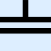</td><td>U+2567</td><td>BOX DRAWINGS UP SINGLE AND HORIZONTAL DOUBLE</td></tr>
<tr><td></td><td>U+2568</td><td>BOX DRAWINGS UP DOUBLE AND HORIZONTAL SINGLE</td></tr>
<tr><td></td><td>U+2569</td><td>BOX DRAWINGS DOUBLE UP AND HORIZONTAL</td></tr>
<tr><td>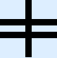</td><td>U+256A</td><td>BOX DRAWINGS VERTICAL SINGLE AND HORIZONTAL DOUBLE</td></tr>
<tr><td></td><td>U+256B</td><td>BOX DRAWINGS VERTICAL DOUBLE AND HORIZONTAL SINGLE</td></tr>
<tr><td></td><td>U+256C</td><td>BOX DRAWINGS DOUBLE VERTICAL AND HORIZONTAL</td></tr>
<tr><td></td><td>U+256D</td><td>BOX DRAWINGS LIGHT ARC DOWN AND RIGHT</td></tr>
<tr><td></td><td>U+256E</td><td>BOX DRAWINGS LIGHT ARC DOWN AND LEFT</td></tr>
<tr><td></td><td>U+256F</td><td>BOX DRAWINGS LIGHT ARC UP AND LEFT</td></tr>
<tr><td></td><td>U+2570</td><td>BOX DRAWINGS LIGHT ARC UP AND RIGHT</td></tr>
<tr><td></td><td>U+2571</td><td>BOX DRAWINGS LIGHT DIAGONAL UPPER RIGHT TO LOWER LEFT</td></tr>
<tr><td></td><td>U+2572</td><td>BOX DRAWINGS LIGHT DIAGONAL UPPER LEFT TO LOWER RIGHT</td></tr>
<tr><td></td><td>U+2573</td><td>BOX DRAWINGS LIGHT DIAGONAL CROSS</td></tr>
<tr><td></td><td>U+2574</td><td>BOX DRAWINGS LIGHT LEFT</td></tr>
<tr><td></td><td>U+2575</td><td>BOX DRAWINGS LIGHT UP</td></tr>
<tr><td></td><td>U+2576</td><td>BOX DRAWINGS LIGHT RIGHT</td></tr>
<tr><td></td><td>U+2577</td><td>BOX DRAWINGS LIGHT DOWN</td></tr>
<tr><td></td><td>U+2578</td><td>BOX DRAWINGS HEAVY LEFT</td></tr>
<tr><td></td><td>U+2579</td><td>BOX DRAWINGS HEAVY UP</td></tr>
<tr><td></td><td>U+257A</td><td>BOX DRAWINGS HEAVY RIGHT</td></tr>
<tr><td></td><td>U+257B</td><td>BOX DRAWINGS HEAVY DOWN</td></tr>
<tr><td></td><td>U+257C</td><td>BOX DRAWINGS LIGHT LEFT AND HEAVY RIGHT</td></tr>
<tr><td></td><td>U+257D</td><td>BOX DRAWINGS LIGHT UP AND HEAVY DOWN</td></tr>
<tr><td></td><td>U+257E</td><td>BOX DRAWINGS HEAVY LEFT AND LIGHT RIGHT</td></tr>
<tr><td></td><td>U+257F</td><td>BOX DRAWINGS HEAVY UP AND LIGHT DOWN</td></tr>
<tr><td></td><td>U+2580</td><td>UPPER HALF BLOCK</td></tr>
<tr><td></td><td>U+2581</td><td>LOWER ONE EIGHTH BLOCK</td></tr>
<tr><td></td><td>U+2582</td><td>LOWER ONE QUARTER BLOCK</td></tr>
<tr><td></td><td>U+2583</td><td>LOWER THREE EIGHTHS BLOCK</td></tr>
<tr><td></td><td>U+2584</td><td>LOWER HALF BLOCK</td></tr>
<tr><td></td><td>U+2585</td><td>LOWER FIVE EIGHTHS BLOCK</td></tr>
<tr><td></td><td>U+2586</td><td>LOWER THREE QUARTERS BLOCK</td></tr>
<tr><td></td><td>U+2587</td><td>LOWER SEVEN EIGHTHS BLOCK</td></tr>
<tr><td></td><td>U+2588</td><td>FULL BLOCK</td></tr>
<tr><td></td><td>U+2589</td><td>LEFT SEVEN EIGHTHS BLOCK</td></tr>
<tr><td></td><td>U+258A</td><td>LEFT THREE QUARTERS BLOCK</td></tr>
<tr><td></td><td>U+258B</td><td>LEFT FIVE EIGHTHS BLOCK</td></tr>
<tr><td></td><td>U+258C</td><td>LEFT HALF BLOCK</td></tr>
<tr><td></td><td>U+258D</td><td>LEFT THREE EIGHTHS BLOCK</td></tr>
<tr><td></td><td>U+258E</td><td>LEFT ONE QUARTER BLOCK</td></tr>
<tr><td></td><td>U+258F</td><td>LEFT ONE EIGHTH BLOCK</td></tr>
<tr><td></td><td>U+2590</td><td>RIGHT HALF BLOCK</td></tr>
<tr><td></td><td>U+2591</td><td>LIGHT SHADE</td></tr>
<tr><td>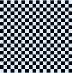</td><td>U+2592</td><td>MEDIUM SHADE</td></tr>
<tr><td></td><td>U+2593</td><td>DARK SHADE</td></tr>
<tr><td></td><td>U+2594</td><td>UPPER ONE EIGHTH BLOCK</td></tr>
<tr><td></td><td>U+2595</td><td>RIGHT ONE EIGHTH BLOCK</td></tr>
<tr><td></td><td>U+2596</td><td>QUADRANT LOWER LEFT</td></tr>
<tr><td></td><td>U+2597</td><td>QUADRANT LOWER RIGHT</td></tr>
<tr><td></td><td>U+2598</td><td>QUADRANT UPPER LEFT</td></tr>
<tr><td></td><td>U+2599</td><td>QUADRANT UPPER LEFT AND LOWER LEFT AND LOWER RIGHT</td></tr>
<tr><td></td><td>U+259A</td><td>QUADRANT UPPER LEFT AND LOWER RIGHT</td></tr>
<tr><td></td><td>U+259B</td><td>QUADRANT UPPER LEFT AND UPPER RIGHT AND LOWER LEFT</td></tr>
<tr><td></td><td>U+259C</td><td>QUADRANT UPPER LEFT AND UPPER RIGHT AND LOWER RIGHT</td></tr>
<tr><td></td><td>U+259D</td><td>QUADRANT UPPER RIGHT</td></tr>
<tr><td></td><td>U+259E</td><td>QUADRANT UPPER RIGHT AND LOWER LEFT</td></tr>
<tr><td></td><td>U+259F</td><td>QUADRANT UPPER RIGHT AND LOWER LEFT AND LOWER RIGHT</td></tr>
<tr><td></td><td>U+25E2</td><td>BLACK LOWER RIGHT TRIANGLE</td></tr>
<tr><td></td><td>U+25E3</td><td>BLACK LOWER LEFT TRIANGLE</td></tr>
<tr><td></td><td>U+25E4</td><td>BLACK UPPER LEFT TRIANGLE</td></tr>
<tr><td></td><td>U+25E5</td><td>BLACK UPPER RIGHT TRIANGLE</td></tr>
<tr><td></td><td>U+27CA</td><td>VERTICAL BAR WITH HORIZONTAL STROKE</td></tr>
<tr><td></td><td>U+1FB00</td><td>BLOCK SEXTANT-1</td></tr>
<tr><td></td><td>U+1FB01</td><td>BLOCK SEXTANT-2</td></tr>
<tr><td></td><td>U+1FB02</td><td>BLOCK SEXTANT-12</td></tr>
<tr><td></td><td>U+1FB03</td><td>BLOCK SEXTANT-3</td></tr>
<tr><td></td><td>U+1FB04</td><td>BLOCK SEXTANT-13</td></tr>
<tr><td></td><td>U+1FB05</td><td>BLOCK SEXTANT-23</td></tr>
<tr><td></td><td>U+1FB06</td><td>BLOCK SEXTANT-123</td></tr>
<tr><td></td><td>U+1FB07</td><td>BLOCK SEXTANT-4</td></tr>
<tr><td></td><td>U+1FB08</td><td>BLOCK SEXTANT-14</td></tr>
<tr><td></td><td>U+1FB09</td><td>BLOCK SEXTANT-24</td></tr>
<tr><td></td><td>U+1FB0A</td><td>BLOCK SEXTANT-124</td></tr>
<tr><td></td><td>U+1FB0B</td><td>BLOCK SEXTANT-34</td></tr>
<tr><td></td><td>U+1FB0C</td><td>BLOCK SEXTANT-134</td></tr>
<tr><td></td><td>U+1FB0D</td><td>BLOCK SEXTANT-234</td></tr>
<tr><td></td><td>U+1FB0E</td><td>BLOCK SEXTANT-1234</td></tr>
<tr><td></td><td>U+1FB0F</td><td>BLOCK SEXTANT-5</td></tr>
<tr><td></td><td>U+1FB10</td><td>BLOCK SEXTANT-15</td></tr>
<tr><td></td><td>U+1FB11</td><td>BLOCK SEXTANT-25</td></tr>
<tr><td></td><td>U+1FB12</td><td>BLOCK SEXTANT-125</td></tr>
<tr><td></td><td>U+1FB13</td><td>BLOCK SEXTANT-35</td></tr>
<tr><td></td><td>U+1FB14</td><td>BLOCK SEXTANT-235</td></tr>
<tr><td></td><td>U+1FB15</td><td>BLOCK SEXTANT-1235</td></tr>
<tr><td></td><td>U+1FB16</td><td>BLOCK SEXTANT-45</td></tr>
<tr><td></td><td>U+1FB17</td><td>BLOCK SEXTANT-145</td></tr>
<tr><td></td><td>U+1FB18</td><td>BLOCK SEXTANT-245</td></tr>
<tr><td></td><td>U+1FB19</td><td>BLOCK SEXTANT-1245</td></tr>
<tr><td></td><td>U+1FB1A</td><td>BLOCK SEXTANT-345</td></tr>
<tr><td></td><td>U+1FB1B</td><td>BLOCK SEXTANT-1345</td></tr>
<tr><td></td><td>U+1FB1C</td><td>BLOCK SEXTANT-2345</td></tr>
<tr><td></td><td>U+1FB1D</td><td>BLOCK SEXTANT-12345</td></tr>
<tr><td></td><td>U+1FB1E</td><td>BLOCK SEXTANT-6</td></tr>
<tr><td></td><td>U+1FB1F</td><td>BLOCK SEXTANT-16</td></tr>
<tr><td></td><td>U+1FB20</td><td>BLOCK SEXTANT-26</td></tr>
<tr><td></td><td>U+1FB21</td><td>BLOCK SEXTANT-126</td></tr>
<tr><td></td><td>U+1FB22</td><td>BLOCK SEXTANT-36</td></tr>
<tr><td></td><td>U+1FB23</td><td>BLOCK SEXTANT-136</td></tr>
<tr><td></td><td>U+1FB24</td><td>BLOCK SEXTANT-236</td></tr>
<tr><td></td><td>U+1FB25</td><td>BLOCK SEXTANT-1236</td></tr>
<tr><td></td><td>U+1FB26</td><td>BLOCK SEXTANT-46</td></tr>
<tr><td></td><td>U+1FB27</td><td>BLOCK SEXTANT-146</td></tr>
<tr><td></td><td>U+1FB28</td><td>BLOCK SEXTANT-1246</td></tr>
<tr><td></td><td>U+1FB29</td><td>BLOCK SEXTANT-346</td></tr>
<tr><td></td><td>U+1FB2A</td><td>BLOCK SEXTANT-1346</td></tr>
<tr><td></td><td>U+1FB2B</td><td>BLOCK SEXTANT-2346</td></tr>
<tr><td></td><td>U+1FB2C</td><td>BLOCK SEXTANT-12346</td></tr>
<tr><td></td><td>U+1FB2D</td><td>BLOCK SEXTANT-56</td></tr>
<tr><td></td><td>U+1FB2E</td><td>BLOCK SEXTANT-156</td></tr>
<tr><td></td><td>U+1FB2F</td><td>BLOCK SEXTANT-256</td></tr>
<tr><td></td><td>U+1FB30</td><td>BLOCK SEXTANT-1256</td></tr>
<tr><td></td><td>U+1FB31</td><td>BLOCK SEXTANT-356</td></tr>
<tr><td></td><td>U+1FB32</td><td>BLOCK SEXTANT-1356</td></tr>
<tr><td></td><td>U+1FB33</td><td>BLOCK SEXTANT-2356</td></tr>
<tr><td></td><td>U+1FB34</td><td>BLOCK SEXTANT-12356</td></tr>
<tr><td></td><td>U+1FB35</td><td>BLOCK SEXTANT-456</td></tr>
<tr><td></td><td>U+1FB36</td><td>BLOCK SEXTANT-1456</td></tr>
<tr><td></td><td>U+1FB37</td><td>BLOCK SEXTANT-2456</td></tr>
<tr><td></td><td>U+1FB38</td><td>BLOCK SEXTANT-12456</td></tr>
<tr><td></td><td>U+1FB39</td><td>BLOCK SEXTANT-3456</td></tr>
<tr><td></td><td>U+1FB3A</td><td>BLOCK SEXTANT-13456</td></tr>
<tr><td></td><td>U+1FB3B</td><td>BLOCK SEXTANT-23456</td></tr>
<tr><td></td><td>U+1FB3C</td><td>LOWER LEFT BLOCK DIAGONAL LOWER MIDDLE LEFT TO LOWER CENTRE</td></tr>
<tr><td></td><td>U+1FB3D</td><td>LOWER LEFT BLOCK DIAGONAL LOWER MIDDLE LEFT TO LOWER RIGHT</td></tr>
<tr><td></td><td>U+1FB3E</td><td>LOWER LEFT BLOCK DIAGONAL UPPER MIDDLE LEFT TO LOWER CENTRE</td></tr>
<tr><td></td><td>U+1FB3F</td><td>LOWER LEFT BLOCK DIAGONAL UPPER MIDDLE LEFT TO LOWER RIGHT</td></tr>
<tr><td></td><td>U+1FB40</td><td>LOWER LEFT BLOCK DIAGONAL UPPER LEFT TO LOWER CENTRE</td></tr>
<tr><td></td><td>U+1FB41</td><td>LOWER RIGHT BLOCK DIAGONAL UPPER MIDDLE LEFT TO UPPER CENTRE</td></tr>
<tr><td></td><td>U+1FB42</td><td>LOWER RIGHT BLOCK DIAGONAL UPPER MIDDLE LEFT TO UPPER RIGHT</td></tr>
<tr><td></td><td>U+1FB43</td><td>LOWER RIGHT BLOCK DIAGONAL LOWER MIDDLE LEFT TO UPPER CENTRE</td></tr>
<tr><td></td><td>U+1FB44</td><td>LOWER RIGHT BLOCK DIAGONAL LOWER MIDDLE LEFT TO UPPER RIGHT</td></tr>
<tr><td></td><td>U+1FB45</td><td>LOWER RIGHT BLOCK DIAGONAL LOWER LEFT TO UPPER CENTRE</td></tr>
<tr><td></td><td>U+1FB46</td><td>LOWER RIGHT BLOCK DIAGONAL LOWER MIDDLE LEFT TO UPPER MIDDLE RIGHT</td></tr>
<tr><td></td><td>U+1FB47</td><td>LOWER RIGHT BLOCK DIAGONAL LOWER CENTRE TO LOWER MIDDLE RIGHT</td></tr>
<tr><td></td><td>U+1FB48</td><td>LOWER RIGHT BLOCK DIAGONAL LOWER LEFT TO LOWER MIDDLE RIGHT</td></tr>
<tr><td></td><td>U+1FB49</td><td>LOWER RIGHT BLOCK DIAGONAL LOWER CENTRE TO UPPER MIDDLE RIGHT</td></tr>
<tr><td></td><td>U+1FB4A</td><td>LOWER RIGHT BLOCK DIAGONAL LOWER LEFT TO UPPER MIDDLE RIGHT</td></tr>
<tr><td></td><td>U+1FB4B</td><td>LOWER RIGHT BLOCK DIAGONAL LOWER CENTRE TO UPPER RIGHT</td></tr>
<tr><td></td><td>U+1FB4C</td><td>LOWER LEFT BLOCK DIAGONAL UPPER CENTRE TO UPPER MIDDLE RIGHT</td></tr>
<tr><td></td><td>U+1FB4D</td><td>LOWER LEFT BLOCK DIAGONAL UPPER LEFT TO UPPER MIDDLE RIGHT</td></tr>
<tr><td></td><td>U+1FB4E</td><td>LOWER LEFT BLOCK DIAGONAL UPPER CENTRE TO LOWER MIDDLE RIGHT</td></tr>
<tr><td></td><td>U+1FB4F</td><td>LOWER LEFT BLOCK DIAGONAL UPPER LEFT TO LOWER MIDDLE RIGHT</td></tr>
<tr><td></td><td>U+1FB50</td><td>LOWER LEFT BLOCK DIAGONAL UPPER CENTRE TO LOWER RIGHT</td></tr>
<tr><td></td><td>U+1FB51</td><td>LOWER LEFT BLOCK DIAGONAL UPPER MIDDLE LEFT TO LOWER MIDDLE RIGHT</td></tr>
<tr><td></td><td>U+1FB52</td><td>UPPER RIGHT BLOCK DIAGONAL LOWER MIDDLE LEFT TO LOWER CENTRE</td></tr>
<tr><td></td><td>U+1FB53</td><td>UPPER RIGHT BLOCK DIAGONAL LOWER MIDDLE LEFT TO LOWER RIGHT</td></tr>
<tr><td></td><td>U+1FB54</td><td>UPPER RIGHT BLOCK DIAGONAL UPPER MIDDLE LEFT TO LOWER CENTRE</td></tr>
<tr><td></td><td>U+1FB55</td><td>UPPER RIGHT BLOCK DIAGONAL UPPER MIDDLE LEFT TO LOWER RIGHT</td></tr>
<tr><td></td><td>U+1FB56</td><td>UPPER RIGHT BLOCK DIAGONAL UPPER LEFT TO LOWER CENTRE</td></tr>
<tr><td></td><td>U+1FB57</td><td>UPPER LEFT BLOCK DIAGONAL UPPER MIDDLE LEFT TO UPPER CENTRE</td></tr>
<tr><td></td><td>U+1FB58</td><td>UPPER LEFT BLOCK DIAGONAL UPPER MIDDLE LEFT TO UPPER RIGHT</td></tr>
<tr><td></td><td>U+1FB59</td><td>UPPER LEFT BLOCK DIAGONAL LOWER MIDDLE LEFT TO UPPER CENTRE</td></tr>
<tr><td></td><td>U+1FB5A</td><td>UPPER LEFT BLOCK DIAGONAL LOWER MIDDLE LEFT TO UPPER RIGHT</td></tr>
<tr><td></td><td>U+1FB5B</td><td>UPPER LEFT BLOCK DIAGONAL LOWER LEFT TO UPPER CENTRE</td></tr>
<tr><td></td><td>U+1FB5C</td><td>UPPER LEFT BLOCK DIAGONAL LOWER MIDDLE LEFT TO UPPER MIDDLE RIGHT</td></tr>
<tr><td></td><td>U+1FB5D</td><td>UPPER LEFT BLOCK DIAGONAL LOWER CENTRE TO LOWER MIDDLE RIGHT</td></tr>
<tr><td></td><td>U+1FB5E</td><td>UPPER LEFT BLOCK DIAGONAL LOWER LEFT TO LOWER MIDDLE RIGHT</td></tr>
<tr><td></td><td>U+1FB5F</td><td>UPPER LEFT BLOCK DIAGONAL LOWER CENTRE TO UPPER MIDDLE RIGHT</td></tr>
<tr><td></td><td>U+1FB60</td><td>UPPER LEFT BLOCK DIAGONAL LOWER LEFT TO UPPER MIDDLE RIGHT</td></tr>
<tr><td></td><td>U+1FB61</td><td>UPPER LEFT BLOCK DIAGONAL LOWER CENTRE TO UPPER RIGHT</td></tr>
<tr><td></td><td>U+1FB62</td><td>UPPER RIGHT BLOCK DIAGONAL UPPER CENTRE TO UPPER MIDDLE RIGHT</td></tr>
<tr><td></td><td>U+1FB63</td><td>UPPER RIGHT BLOCK DIAGONAL UPPER LEFT TO UPPER MIDDLE RIGHT</td></tr>
<tr><td></td><td>U+1FB64</td><td>UPPER RIGHT BLOCK DIAGONAL UPPER CENTRE TO LOWER MIDDLE RIGHT</td></tr>
<tr><td></td><td>U+1FB65</td><td>UPPER RIGHT BLOCK DIAGONAL UPPER LEFT TO LOWER MIDDLE RIGHT</td></tr>
<tr><td></td><td>U+1FB66</td><td>UPPER RIGHT BLOCK DIAGONAL UPPER CENTRE TO LOWER RIGHT</td></tr>
<tr><td></td><td>U+1FB67</td><td>UPPER RIGHT BLOCK DIAGONAL UPPER MIDDLE LEFT TO LOWER MIDDLE RIGHT</td></tr>
<tr><td></td><td>U+1FB68</td><td>UPPER AND RIGHT AND LOWER TRIANGULAR THREE QUARTERS BLOCK</td></tr>
<tr><td></td><td>U+1FB69</td><td>LEFT AND LOWER AND RIGHT TRIANGULAR THREE QUARTERS BLOCK</td></tr>
<tr><td></td><td>U+1FB6A</td><td>UPPER AND LEFT AND LOWER TRIANGULAR THREE QUARTERS BLOCK</td></tr>
<tr><td></td><td>U+1FB6B</td><td>LEFT AND UPPER AND RIGHT TRIANGULAR THREE QUARTERS BLOCK</td></tr>
<tr><td></td><td>U+1FB6C</td><td>LEFT TRIANGULAR ONE QUARTER BLOCK</td></tr>
<tr><td></td><td>U+1FB6D</td><td>UPPER TRIANGULAR ONE QUARTER BLOCK</td></tr>
<tr><td></td><td>U+1FB6E</td><td>RIGHT TRIANGULAR ONE QUARTER BLOCK</td></tr>
<tr><td></td><td>U+1FB6F</td><td>LOWER TRIANGULAR ONE QUARTER BLOCK</td></tr>
<tr><td></td><td>U+1FB70</td><td>VERTICAL ONE EIGHTH BLOCK-2</td></tr>
<tr><td></td><td>U+1FB71</td><td>VERTICAL ONE EIGHTH BLOCK-3</td></tr>
<tr><td></td><td>U+1FB72</td><td>VERTICAL ONE EIGHTH BLOCK-4</td></tr>
<tr><td></td><td>U+1FB73</td><td>VERTICAL ONE EIGHTH BLOCK-5</td></tr>
<tr><td></td><td>U+1FB74</td><td>VERTICAL ONE EIGHTH BLOCK-6</td></tr>
<tr><td></td><td>U+1FB75</td><td>VERTICAL ONE EIGHTH BLOCK-7</td></tr>
<tr><td></td><td>U+1FB76</td><td>HORIZONTAL ONE EIGHTH BLOCK-2</td></tr>
<tr><td></td><td>U+1FB77</td><td>HORIZONTAL ONE EIGHTH BLOCK-3</td></tr>
<tr><td></td><td>U+1FB78</td><td>HORIZONTAL ONE EIGHTH BLOCK-4</td></tr>
<tr><td></td><td>U+1FB79</td><td>HORIZONTAL ONE EIGHTH BLOCK-5</td></tr>
<tr><td></td><td>U+1FB7A</td><td>HORIZONTAL ONE EIGHTH BLOCK-6</td></tr>
<tr><td></td><td>U+1FB7B</td><td>HORIZONTAL ONE EIGHTH BLOCK-7</td></tr>
<tr><td></td><td>U+1FB7C</td><td>LEFT AND LOWER ONE EIGHTH BLOCK</td></tr>
<tr><td></td><td>U+1FB7D</td><td>LEFT AND UPPER ONE EIGHTH BLOCK</td></tr>
<tr><td></td><td>U+1FB7E</td><td>RIGHT AND UPPER ONE EIGHTH BLOCK</td></tr>
<tr><td></td><td>U+1FB7F</td><td>RIGHT AND LOWER ONE EIGHTH BLOCK</td></tr>
<tr><td></td><td>U+1FB80</td><td>UPPER AND LOWER ONE EIGHTH BLOCK</td></tr>
<tr><td></td><td>U+1FB81</td><td>HORIZONTAL ONE EIGHTH BLOCK-1358</td></tr>
<tr><td></td><td>U+1FB82</td><td>UPPER ONE QUARTER BLOCK</td></tr>
<tr><td></td><td>U+1FB83</td><td>UPPER THREE EIGHTHS BLOCK</td></tr>
<tr><td></td><td>U+1FB84</td><td>UPPER FIVE EIGHTHS BLOCK</td></tr>
<tr><td></td><td>U+1FB85</td><td>UPPER THREE QUARTERS BLOCK</td></tr>
<tr><td></td><td>U+1FB86</td><td>UPPER SEVEN EIGHTHS BLOCK</td></tr>
<tr><td></td><td>U+1FB87</td><td>RIGHT ONE QUARTER BLOCK</td></tr>
<tr><td></td><td>U+1FB88</td><td>RIGHT THREE EIGHTHS BLOCK</td></tr>
<tr><td></td><td>U+1FB89</td><td>RIGHT FIVE EIGHTHS BLOCK</td></tr>
<tr><td></td><td>U+1FB8A</td><td>RIGHT THREE QUARTERS BLOCK</td></tr>
<tr><td></td><td>U+1FB8B</td><td>RIGHT SEVEN EIGHTHS BLOCK</td></tr>
<tr><td></td><td>U+1FB8C</td><td>LEFT HALF MEDIUM SHADE</td></tr>
<tr><td>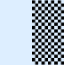</td><td>U+1FB8D</td><td>RIGHT HALF MEDIUM SHADE</td></tr>
<tr><td></td><td>U+1FB8E</td><td>UPPER HALF MEDIUM SHADE</td></tr>
<tr><td></td><td>U+1FB8F</td><td>LOWER HALF MEDIUM SHADE</td></tr>
<tr><td></td><td>U+1FB90</td><td>INVERSE MEDIUM SHADE</td></tr>
<tr><td></td><td>U+1FB91</td><td>UPPER HALF BLOCK AND LOWER HALF INVERSE MEDIUM SHADE</td></tr>
<tr><td></td><td>U+1FB92</td><td>UPPER HALF INVERSE MEDIUM SHADE AND LOWER HALF BLOCK</td></tr>
<tr><td>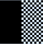</td><td>U+1FB93</td><td>LEFT HALF BLOCK AND RIGHT HALF INVERSE MEDIUM SHADE</td></tr>
<tr><td></td><td>U+1FB94</td><td>LEFT HALF INVERSE MEDIUM SHADE AND RIGHT HALF BLOCK</td></tr>
<tr><td></td><td>U+1FB95</td><td>CHECKER BOARD FILL</td></tr>
<tr><td></td><td>U+1FB96</td><td>INVERSE CHECKER BOARD FILL</td></tr>
<tr><td></td><td>U+1FB97</td><td>HEAVY HORIZONTAL FILL</td></tr>
<tr><td></td><td>U+1FB98</td><td>UPPER LEFT TO LOWER RIGHT FILL</td></tr>
<tr><td></td><td>U+1FB99</td><td>UPPER RIGHT TO LOWER LEFT FILL</td></tr>
<tr><td></td><td>U+1FB9A</td><td>UPPER AND LOWER TRIANGULAR HALF BLOCK</td></tr>
<tr><td></td><td>U+1FB9B</td><td>LEFT AND RIGHT TRIANGULAR HALF BLOCK</td></tr>
<tr><td></td><td>U+1FB9C</td><td>UPPER LEFT TRIANGULAR MEDIUM SHADE</td></tr>
<tr><td></td><td>U+1FB9D</td><td>UPPER RIGHT TRIANGULAR MEDIUM SHADE</td></tr>
<tr><td></td><td>U+1FB9E</td><td>LOWER RIGHT TRIANGULAR MEDIUM SHADE</td></tr>
<tr><td></td><td>U+1FB9F</td><td>LOWER LEFT TRIANGULAR MEDIUM SHADE</td></tr>
<tr><td></td><td>U+1FBA0</td><td>BOX DRAWINGS LIGHT DIAGONAL UPPER CENTRE TO MIDDLE LEFT</td></tr>
<tr><td></td><td>U+1FBA1</td><td>BOX DRAWINGS LIGHT DIAGONAL UPPER CENTRE TO MIDDLE RIGHT</td></tr>
<tr><td></td><td>U+1FBA2</td><td>BOX DRAWINGS LIGHT DIAGONAL MIDDLE LEFT TO LOWER CENTRE</td></tr>
<tr><td></td><td>U+1FBA3</td><td>BOX DRAWINGS LIGHT DIAGONAL MIDDLE RIGHT TO LOWER CENTRE</td></tr>
<tr><td></td><td>U+1FBA4</td><td>BOX DRAWINGS LIGHT DIAGONAL UPPER CENTRE TO MIDDLE LEFT TO LOWER CENTRE</td></tr>
<tr><td></td><td>U+1FBA5</td><td>BOX DRAWINGS LIGHT DIAGONAL UPPER CENTRE TO MIDDLE RIGHT TO LOWER CENTRE</td></tr>
<tr><td></td><td>U+1FBA6</td><td>BOX DRAWINGS LIGHT DIAGONAL MIDDLE LEFT TO LOWER CENTRE TO MIDDLE RIGHT</td></tr>
<tr><td></td><td>U+1FBA7</td><td>BOX DRAWINGS LIGHT DIAGONAL MIDDLE LEFT TO UPPER CENTRE TO MIDDLE RIGHT</td></tr>
<tr><td></td><td>U+1FBA8</td><td>BOX DRAWINGS LIGHT DIAGONAL UPPER CENTRE TO MIDDLE LEFT AND MIDDLE RIGHT TO LOWER CENTRE</td></tr>
<tr><td></td><td>U+1FBA9</td><td>BOX DRAWINGS LIGHT DIAGONAL UPPER CENTRE TO MIDDLE RIGHT AND MIDDLE LEFT TO LOWER CENTRE</td></tr>
<tr><td></td><td>U+1FBAA</td><td>BOX DRAWINGS LIGHT DIAGONAL UPPER CENTRE TO MIDDLE RIGHT TO LOWER CENTRE TO MIDDLE LEFT</td></tr>
<tr><td></td><td>U+1FBAB</td><td>BOX DRAWINGS LIGHT DIAGONAL UPPER CENTRE TO MIDDLE LEFT TO LOWER CENTRE TO MIDDLE RIGHT</td></tr>
<tr><td>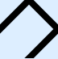</td><td>U+1FBAC</td><td>BOX DRAWINGS LIGHT DIAGONAL MIDDLE LEFT TO UPPER CENTRE TO MIDDLE RIGHT TO LOWER CENTRE</td></tr>
<tr><td>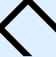</td><td>U+1FBAD</td><td>BOX DRAWINGS LIGHT DIAGONAL MIDDLE RIGHT TO UPPER CENTRE TO MIDDLE LEFT TO LOWER CENTRE</td></tr>
<tr><td></td><td>U+1FBAE</td><td>BOX DRAWINGS LIGHT DIAGONAL DIAMOND</td></tr>
<tr><td>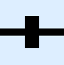</td><td>U+1FBAF</td><td>BOX DRAWINGS LIGHT HORIZONTAL WITH VERTICAL STROKE</td></tr>
<tr><td></td><td>U+1FBCE</td><td>LEFT TWO THIRDS BLOCK</td></tr>
<tr><td></td><td>U+1FBCF</td><td>LEFT ONE THIRD BLOCK</td></tr>
<tr><td></td><td>U+1FBD0</td><td>BOX DRAWINGS LIGHT DIAGONAL MIDDLE RIGHT TO LOWER LEFT</td></tr>
<tr><td></td><td>U+1FBD1</td><td>BOX DRAWINGS LIGHT DIAGONAL UPPER RIGHT TO MIDDLE LEFT</td></tr>
<tr><td></td><td>U+1FBD2</td><td>BOX DRAWINGS LIGHT DIAGONAL UPPER LEFT TO MIDDLE RIGHT</td></tr>
<tr><td></td><td>U+1FBD3</td><td>BOX DRAWINGS LIGHT DIAGONAL MIDDLE LEFT TO LOWER RIGHT</td></tr>
<tr><td></td><td>U+1FBD4</td><td>BOX DRAWINGS LIGHT DIAGONAL UPPER LEFT TO LOWER CENTRE</td></tr>
<tr><td></td><td>U+1FBD5</td><td>BOX DRAWINGS LIGHT DIAGONAL UPPER CENTRE TO LOWER RIGHT</td></tr>
<tr><td></td><td>U+1FBD6</td><td>BOX DRAWINGS LIGHT DIAGONAL UPPER RIGHT TO LOWER CENTRE</td></tr>
<tr><td></td><td>U+1FBD7</td><td>BOX DRAWINGS LIGHT DIAGONAL UPPER CENTRE TO LOWER LEFT</td></tr>
<tr><td></td><td>U+1FBD8</td><td>BOX DRAWINGS LIGHT DIAGONAL UPPER LEFT TO MIDDLE CENTRE TO UPPER RIGHT</td></tr>
<tr><td></td><td>U+1FBD9</td><td>BOX DRAWINGS LIGHT DIAGONAL UPPER RIGHT TO MIDDLE CENTRE TO LOWER RIGHT</td></tr>
<tr><td></td><td>U+1FBDA</td><td>BOX DRAWINGS LIGHT DIAGONAL LOWER LEFT TO MIDDLE CENTRE TO LOWER RIGHT</td></tr>
<tr><td></td><td>U+1FBDB</td><td>BOX DRAWINGS LIGHT DIAGONAL UPPER LEFT TO MIDDLE CENTRE TO LOWER LEFT</td></tr>
<tr><td></td><td>U+1FBDC</td><td>BOX DRAWINGS LIGHT DIAGONAL UPPER LEFT TO LOWER CENTRE TO UPPER RIGHT</td></tr>
<tr><td></td><td>U+1FBDD</td><td>BOX DRAWINGS LIGHT DIAGONAL UPPER RIGHT TO MIDDLE LEFT TO LOWER RIGHT</td></tr>
<tr><td></td><td>U+1FBDE</td><td>BOX DRAWINGS LIGHT DIAGONAL LOWER LEFT TO UPPER CENTRE TO LOWER RIGHT</td></tr>
<tr><td></td><td>U+1FBDF</td><td>BOX DRAWINGS LIGHT DIAGONAL UPPER LEFT TO MIDDLE RIGHT TO LOWER LEFT</td></tr>
<tr><td></td><td>U+1FBE0</td><td>TOP JUSTIFIED LOWER HALF WHITE CIRCLE</td></tr>
<tr><td></td><td>U+1FBE1</td><td>RIGHT JUSTIFIED LEFT HALF WHITE CIRCLE</td></tr>
<tr><td></td><td>U+1FBE2</td><td>BOTTOM JUSTIFIED UPPER HALF WHITE CIRCLE</td></tr>
<tr><td></td><td>U+1FBE3</td><td>LEFT JUSTIFIED RIGHT HALF WHITE CIRCLE</td></tr>
<tr><td></td><td>U+1FBE4</td><td>UPPER CENTRE ONE QUARTER BLOCK</td></tr>
<tr><td></td><td>U+1FBE5</td><td>LOWER CENTRE ONE QUARTER BLOCK</td></tr>
<tr><td></td><td>U+1FBE6</td><td>MIDDLE LEFT ONE QUARTER BLOCK</td></tr>
<tr><td></td><td>U+1FBE7</td><td>MIDDLE RIGHT ONE QUARTER BLOCK</td></tr>
<tr><td></td><td>U+1FBE8</td><td>TOP JUSTIFIED LOWER HALF BLACK CIRCLE</td></tr>
<tr><td></td><td>U+1FBE9</td><td>RIGHT JUSTIFIED LEFT HALF BLACK CIRCLE</td></tr>
<tr><td></td><td>U+1FBEA</td><td>BOTTOM JUSTIFIED UPPER HALF BLACK CIRCLE</td></tr>
<tr><td></td><td>U+1FBEB</td><td>LEFT JUSTIFIED RIGHT HALF BLACK CIRCLE</td></tr>
<tr><td></td><td>U+1FBEC</td><td>TOP RIGHT JUSTIFIED LOWER LEFT QUARTER BLACK CIRCLE</td></tr>
<tr><td></td><td>U+1FBED</td><td>BOTTOM LEFT JUSTIFIED UPPER RIGHT QUARTER BLACK CIRCLE</td></tr>
<tr><td></td><td>U+1FBEE</td><td>BOTTOM RIGHT JUSTIFIED UPPER LEFT QUARTER BLACK CIRCLE</td></tr>
<tr><td></td><td>U+1FBEF</td><td>TOP LEFT JUSTIFIED LOWER RIGHT QUARTER BLACK CIRCLE</td></tr>
<tr><td></td><td>U+1CC1B</td><td>BOX DRAWINGS LIGHT HORIZONTAL AND UPPER RIGHT</td></tr>
<tr><td></td><td>U+1CC1C</td><td>BOX DRAWINGS LIGHT HORIZONTAL AND LOWER RIGHT</td></tr>
<tr><td></td><td>U+1CC1D</td><td>BOX DRAWINGS LIGHT TOP AND UPPER LEFT</td></tr>
<tr><td></td><td>U+1CC1E</td><td>BOX DRAWINGS LIGHT BOTTOM AND LOWER LEFT</td></tr>
<tr><td></td><td>U+1CC1F</td><td>BOX DRAWINGS DOUBLE DIAGONAL UPPER RIGHT TO LOWER LEFT</td></tr>
<tr><td></td><td>U+1CC20</td><td>BOX DRAWINGS DOUBLE DIAGONAL UPPER LEFT TO LOWER RIGHT</td></tr>
<tr><td></td><td>U+1CC21</td><td>SEPARATED BLOCK QUADRANT-1</td></tr>
<tr><td></td><td>U+1CC22</td><td>SEPARATED BLOCK QUADRANT-2</td></tr>
<tr><td></td><td>U+1CC23</td><td>SEPARATED BLOCK QUADRANT-12</td></tr>
<tr><td></td><td>U+1CC24</td><td>SEPARATED BLOCK QUADRANT-3</td></tr>
<tr><td></td><td>U+1CC25</td><td>SEPARATED BLOCK QUADRANT-13</td></tr>
<tr><td></td><td>U+1CC26</td><td>SEPARATED BLOCK QUADRANT-23</td></tr>
<tr><td></td><td>U+1CC27</td><td>SEPARATED BLOCK QUADRANT-123</td></tr>
<tr><td></td><td>U+1CC28</td><td>SEPARATED BLOCK QUADRANT-4</td></tr>
<tr><td></td><td>U+1CC29</td><td>SEPARATED BLOCK QUADRANT-14</td></tr>
<tr><td></td><td>U+1CC2A</td><td>SEPARATED BLOCK QUADRANT-24</td></tr>
<tr><td></td><td>U+1CC2B</td><td>SEPARATED BLOCK QUADRANT-124</td></tr>
<tr><td></td><td>U+1CC2C</td><td>SEPARATED BLOCK QUADRANT-34</td></tr>
<tr><td></td><td>U+1CC2D</td><td>SEPARATED BLOCK QUADRANT-134</td></tr>
<tr><td></td><td>U+1CC2E</td><td>SEPARATED BLOCK QUADRANT-234</td></tr>
<tr><td></td><td>U+1CC2F</td><td>SEPARATED BLOCK QUADRANT-1234</td></tr>
<tr><td></td><td>U+1CC30</td><td>UPPER LEFT TWELFTH CIRCLE</td></tr>
<tr><td></td><td>U+1CC31</td><td>UPPER CENTRE LEFT TWELFTH CIRCLE</td></tr>
<tr><td></td><td>U+1CC32</td><td>UPPER CENTRE RIGHT TWELFTH CIRCLE</td></tr>
<tr><td></td><td>U+1CC33</td><td>UPPER RIGHT TWELFTH CIRCLE</td></tr>
<tr><td></td><td>U+1CC34</td><td>UPPER MIDDLE LEFT TWELFTH CIRCLE</td></tr>
<tr><td></td><td>U+1CC35</td><td>UPPER LEFT QUARTER CIRCLE</td></tr>
<tr><td></td><td>U+1CC36</td><td>UPPER RIGHT QUARTER CIRCLE</td></tr>
<tr><td></td><td>U+1CC37</td><td>UPPER MIDDLE RIGHT TWELFTH CIRCLE</td></tr>
<tr><td></td><td>U+1CC38</td><td>LOWER MIDDLE LEFT TWELFTH CIRCLE</td></tr>
<tr><td></td><td>U+1CC39</td><td>LOWER LEFT QUARTER CIRCLE</td></tr>
<tr><td></td><td>U+1CC3A</td><td>LOWER RIGHT QUARTER CIRCLE</td></tr>
<tr><td></td><td>U+1CC3B</td><td>LOWER MIDDLE RIGHT TWELFTH CIRCLE</td></tr>
<tr><td></td><td>U+1CC3C</td><td>LOWER LEFT TWELFTH CIRCLE</td></tr>
<tr><td></td><td>U+1CC3D</td><td>LOWER CENTRE LEFT TWELFTH CIRCLE</td></tr>
<tr><td></td><td>U+1CC3E</td><td>LOWER CENTRE RIGHT TWELFTH CIRCLE</td></tr>
<tr><td></td><td>U+1CC3F</td><td>LOWER RIGHT TWELFTH CIRCLE</td></tr>
<tr><td></td><td>U+1CD00</td><td>BLOCK OCTANT-3</td></tr>
<tr><td></td><td>U+1CD01</td><td>BLOCK OCTANT-23</td></tr>
<tr><td></td><td>U+1CD02</td><td>BLOCK OCTANT-123</td></tr>
<tr><td></td><td>U+1CD03</td><td>BLOCK OCTANT-4</td></tr>
<tr><td></td><td>U+1CD04</td><td>BLOCK OCTANT-14</td></tr>
<tr><td></td><td>U+1CD05</td><td>BLOCK OCTANT-124</td></tr>
<tr><td></td><td>U+1CD06</td><td>BLOCK OCTANT-34</td></tr>
<tr><td></td><td>U+1CD07</td><td>BLOCK OCTANT-134</td></tr>
<tr><td></td><td>U+1CD08</td><td>BLOCK OCTANT-234</td></tr>
<tr><td></td><td>U+1CD09</td><td>BLOCK OCTANT-5</td></tr>
<tr><td></td><td>U+1CD0A</td><td>BLOCK OCTANT-15</td></tr>
<tr><td></td><td>U+1CD0B</td><td>BLOCK OCTANT-25</td></tr>
<tr><td></td><td>U+1CD0C</td><td>BLOCK OCTANT-125</td></tr>
<tr><td></td><td>U+1CD0D</td><td>BLOCK OCTANT-135</td></tr>
<tr><td></td><td>U+1CD0E</td><td>BLOCK OCTANT-235</td></tr>
<tr><td></td><td>U+1CD0F</td><td>BLOCK OCTANT-1235</td></tr>
<tr><td></td><td>U+1CD10</td><td>BLOCK OCTANT-45</td></tr>
<tr><td></td><td>U+1CD11</td><td>BLOCK OCTANT-145</td></tr>
<tr><td></td><td>U+1CD12</td><td>BLOCK OCTANT-245</td></tr>
<tr><td></td><td>U+1CD13</td><td>BLOCK OCTANT-1245</td></tr>
<tr><td></td><td>U+1CD14</td><td>BLOCK OCTANT-345</td></tr>
<tr><td></td><td>U+1CD15</td><td>BLOCK OCTANT-1345</td></tr>
<tr><td></td><td>U+1CD16</td><td>BLOCK OCTANT-2345</td></tr>
<tr><td></td><td>U+1CD17</td><td>BLOCK OCTANT-12345</td></tr>
<tr><td></td><td>U+1CD18</td><td>BLOCK OCTANT-6</td></tr>
<tr><td></td><td>U+1CD19</td><td>BLOCK OCTANT-16</td></tr>
<tr><td></td><td>U+1CD1A</td><td>BLOCK OCTANT-26</td></tr>
<tr><td></td><td>U+1CD1B</td><td>BLOCK OCTANT-126</td></tr>
<tr><td></td><td>U+1CD1C</td><td>BLOCK OCTANT-36</td></tr>
<tr><td></td><td>U+1CD1D</td><td>BLOCK OCTANT-136</td></tr>
<tr><td></td><td>U+1CD1E</td><td>BLOCK OCTANT-236</td></tr>
<tr><td></td><td>U+1CD1F</td><td>BLOCK OCTANT-1236</td></tr>
<tr><td></td><td>U+1CD20</td><td>BLOCK OCTANT-146</td></tr>
<tr><td></td><td>U+1CD21</td><td>BLOCK OCTANT-246</td></tr>
<tr><td></td><td>U+1CD22</td><td>BLOCK OCTANT-1246</td></tr>
<tr><td></td><td>U+1CD23</td><td>BLOCK OCTANT-346</td></tr>
<tr><td></td><td>U+1CD24</td><td>BLOCK OCTANT-1346</td></tr>
<tr><td></td><td>U+1CD25</td><td>BLOCK OCTANT-2346</td></tr>
<tr><td></td><td>U+1CD26</td><td>BLOCK OCTANT-12346</td></tr>
<tr><td></td><td>U+1CD27</td><td>BLOCK OCTANT-56</td></tr>
<tr><td></td><td>U+1CD28</td><td>BLOCK OCTANT-156</td></tr>
<tr><td></td><td>U+1CD29</td><td>BLOCK OCTANT-256</td></tr>
<tr><td></td><td>U+1CD2A</td><td>BLOCK OCTANT-1256</td></tr>
<tr><td></td><td>U+1CD2B</td><td>BLOCK OCTANT-356</td></tr>
<tr><td></td><td>U+1CD2C</td><td>BLOCK OCTANT-1356</td></tr>
<tr><td></td><td>U+1CD2D</td><td>BLOCK OCTANT-2356</td></tr>
<tr><td></td><td>U+1CD2E</td><td>BLOCK OCTANT-12356</td></tr>
<tr><td></td><td>U+1CD2F</td><td>BLOCK OCTANT-456</td></tr>
<tr><td></td><td>U+1CD30</td><td>BLOCK OCTANT-1456</td></tr>
<tr><td></td><td>U+1CD31</td><td>BLOCK OCTANT-2456</td></tr>
<tr><td></td><td>U+1CD32</td><td>BLOCK OCTANT-12456</td></tr>
<tr><td></td><td>U+1CD33</td><td>BLOCK OCTANT-3456</td></tr>
<tr><td></td><td>U+1CD34</td><td>BLOCK OCTANT-13456</td></tr>
<tr><td></td><td>U+1CD35</td><td>BLOCK OCTANT-23456</td></tr>
<tr><td></td><td>U+1CD36</td><td>BLOCK OCTANT-17</td></tr>
<tr><td></td><td>U+1CD37</td><td>BLOCK OCTANT-27</td></tr>
<tr><td></td><td>U+1CD38</td><td>BLOCK OCTANT-127</td></tr>
<tr><td></td><td>U+1CD39</td><td>BLOCK OCTANT-37</td></tr>
<tr><td></td><td>U+1CD3A</td><td>BLOCK OCTANT-137</td></tr>
<tr><td></td><td>U+1CD3B</td><td>BLOCK OCTANT-237</td></tr>
<tr><td></td><td>U+1CD3C</td><td>BLOCK OCTANT-1237</td></tr>
<tr><td></td><td>U+1CD3D</td><td>BLOCK OCTANT-47</td></tr>
<tr><td></td><td>U+1CD3E</td><td>BLOCK OCTANT-147</td></tr>
<tr><td></td><td>U+1CD3F</td><td>BLOCK OCTANT-247</td></tr>
<tr><td></td><td>U+1CD40</td><td>BLOCK OCTANT-1247</td></tr>
<tr><td></td><td>U+1CD41</td><td>BLOCK OCTANT-347</td></tr>
<tr><td></td><td>U+1CD42</td><td>BLOCK OCTANT-1347</td></tr>
<tr><td></td><td>U+1CD43</td><td>BLOCK OCTANT-2347</td></tr>
<tr><td></td><td>U+1CD44</td><td>BLOCK OCTANT-12347</td></tr>
<tr><td></td><td>U+1CD45</td><td>BLOCK OCTANT-157</td></tr>
<tr><td></td><td>U+1CD46</td><td>BLOCK OCTANT-257</td></tr>
<tr><td></td><td>U+1CD47</td><td>BLOCK OCTANT-1257</td></tr>
<tr><td></td><td>U+1CD48</td><td>BLOCK OCTANT-357</td></tr>
<tr><td></td><td>U+1CD49</td><td>BLOCK OCTANT-2357</td></tr>
<tr><td></td><td>U+1CD4A</td><td>BLOCK OCTANT-12357</td></tr>
<tr><td></td><td>U+1CD4B</td><td>BLOCK OCTANT-457</td></tr>
<tr><td></td><td>U+1CD4C</td><td>BLOCK OCTANT-1457</td></tr>
<tr><td></td><td>U+1CD4D</td><td>BLOCK OCTANT-12457</td></tr>
<tr><td></td><td>U+1CD4E</td><td>BLOCK OCTANT-3457</td></tr>
<tr><td></td><td>U+1CD4F</td><td>BLOCK OCTANT-13457</td></tr>
<tr><td></td><td>U+1CD50</td><td>BLOCK OCTANT-23457</td></tr>
<tr><td></td><td>U+1CD51</td><td>BLOCK OCTANT-67</td></tr>
<tr><td></td><td>U+1CD52</td><td>BLOCK OCTANT-167</td></tr>
<tr><td></td><td>U+1CD53</td><td>BLOCK OCTANT-267</td></tr>
<tr><td></td><td>U+1CD54</td><td>BLOCK OCTANT-1267</td></tr>
<tr><td></td><td>U+1CD55</td><td>BLOCK OCTANT-367</td></tr>
<tr><td></td><td>U+1CD56</td><td>BLOCK OCTANT-1367</td></tr>
<tr><td></td><td>U+1CD57</td><td>BLOCK OCTANT-2367</td></tr>
<tr><td></td><td>U+1CD58</td><td>BLOCK OCTANT-12367</td></tr>
<tr><td></td><td>U+1CD59</td><td>BLOCK OCTANT-467</td></tr>
<tr><td></td><td>U+1CD5A</td><td>BLOCK OCTANT-1467</td></tr>
<tr><td></td><td>U+1CD5B</td><td>BLOCK OCTANT-2467</td></tr>
<tr><td></td><td>U+1CD5C</td><td>BLOCK OCTANT-12467</td></tr>
<tr><td></td><td>U+1CD5D</td><td>BLOCK OCTANT-3467</td></tr>
<tr><td></td><td>U+1CD5E</td><td>BLOCK OCTANT-13467</td></tr>
<tr><td></td><td>U+1CD5F</td><td>BLOCK OCTANT-23467</td></tr>
<tr><td></td><td>U+1CD60</td><td>BLOCK OCTANT-123467</td></tr>
<tr><td></td><td>U+1CD61</td><td>BLOCK OCTANT-567</td></tr>
<tr><td></td><td>U+1CD62</td><td>BLOCK OCTANT-1567</td></tr>
<tr><td></td><td>U+1CD63</td><td>BLOCK OCTANT-2567</td></tr>
<tr><td></td><td>U+1CD64</td><td>BLOCK OCTANT-12567</td></tr>
<tr><td></td><td>U+1CD65</td><td>BLOCK OCTANT-3567</td></tr>
<tr><td></td><td>U+1CD66</td><td>BLOCK OCTANT-13567</td></tr>
<tr><td></td><td>U+1CD67</td><td>BLOCK OCTANT-23567</td></tr>
<tr><td></td><td>U+1CD68</td><td>BLOCK OCTANT-123567</td></tr>
<tr><td></td><td>U+1CD69</td><td>BLOCK OCTANT-4567</td></tr>
<tr><td></td><td>U+1CD6A</td><td>BLOCK OCTANT-14567</td></tr>
<tr><td></td><td>U+1CD6B</td><td>BLOCK OCTANT-24567</td></tr>
<tr><td></td><td>U+1CD6C</td><td>BLOCK OCTANT-124567</td></tr>
<tr><td></td><td>U+1CD6D</td><td>BLOCK OCTANT-34567</td></tr>
<tr><td></td><td>U+1CD6E</td><td>BLOCK OCTANT-134567</td></tr>
<tr><td></td><td>U+1CD6F</td><td>BLOCK OCTANT-234567</td></tr>
<tr><td></td><td>U+1CD70</td><td>BLOCK OCTANT-1234567</td></tr>
<tr><td></td><td>U+1CD71</td><td>BLOCK OCTANT-18</td></tr>
<tr><td></td><td>U+1CD72</td><td>BLOCK OCTANT-28</td></tr>
<tr><td></td><td>U+1CD73</td><td>BLOCK OCTANT-128</td></tr>
<tr><td></td><td>U+1CD74</td><td>BLOCK OCTANT-38</td></tr>
<tr><td></td><td>U+1CD75</td><td>BLOCK OCTANT-138</td></tr>
<tr><td></td><td>U+1CD76</td><td>BLOCK OCTANT-238</td></tr>
<tr><td></td><td>U+1CD77</td><td>BLOCK OCTANT-1238</td></tr>
<tr><td></td><td>U+1CD78</td><td>BLOCK OCTANT-48</td></tr>
<tr><td></td><td>U+1CD79</td><td>BLOCK OCTANT-148</td></tr>
<tr><td></td><td>U+1CD7A</td><td>BLOCK OCTANT-248</td></tr>
<tr><td></td><td>U+1CD7B</td><td>BLOCK OCTANT-1248</td></tr>
<tr><td></td><td>U+1CD7C</td><td>BLOCK OCTANT-348</td></tr>
<tr><td></td><td>U+1CD7D</td><td>BLOCK OCTANT-1348</td></tr>
<tr><td></td><td>U+1CD7E</td><td>BLOCK OCTANT-2348</td></tr>
<tr><td></td><td>U+1CD7F</td><td>BLOCK OCTANT-12348</td></tr>
<tr><td></td><td>U+1CD80</td><td>BLOCK OCTANT-58</td></tr>
<tr><td></td><td>U+1CD81</td><td>BLOCK OCTANT-158</td></tr>
<tr><td></td><td>U+1CD82</td><td>BLOCK OCTANT-258</td></tr>
<tr><td></td><td>U+1CD83</td><td>BLOCK OCTANT-1258</td></tr>
<tr><td></td><td>U+1CD84</td><td>BLOCK OCTANT-358</td></tr>
<tr><td></td><td>U+1CD85</td><td>BLOCK OCTANT-1358</td></tr>
<tr><td></td><td>U+1CD86</td><td>BLOCK OCTANT-2358</td></tr>
<tr><td></td><td>U+1CD87</td><td>BLOCK OCTANT-12358</td></tr>
<tr><td></td><td>U+1CD88</td><td>BLOCK OCTANT-458</td></tr>
<tr><td></td><td>U+1CD89</td><td>BLOCK OCTANT-1458</td></tr>
<tr><td></td><td>U+1CD8A</td><td>BLOCK OCTANT-2458</td></tr>
<tr><td></td><td>U+1CD8B</td><td>BLOCK OCTANT-12458</td></tr>
<tr><td></td><td>U+1CD8C</td><td>BLOCK OCTANT-3458</td></tr>
<tr><td></td><td>U+1CD8D</td><td>BLOCK OCTANT-13458</td></tr>
<tr><td></td><td>U+1CD8E</td><td>BLOCK OCTANT-23458</td></tr>
<tr><td></td><td>U+1CD8F</td><td>BLOCK OCTANT-123458</td></tr>
<tr><td></td><td>U+1CD90</td><td>BLOCK OCTANT-168</td></tr>
<tr><td></td><td>U+1CD91</td><td>BLOCK OCTANT-268</td></tr>
<tr><td></td><td>U+1CD92</td><td>BLOCK OCTANT-1268</td></tr>
<tr><td></td><td>U+1CD93</td><td>BLOCK OCTANT-368</td></tr>
<tr><td></td><td>U+1CD94</td><td>BLOCK OCTANT-2368</td></tr>
<tr><td></td><td>U+1CD95</td><td>BLOCK OCTANT-12368</td></tr>
<tr><td></td><td>U+1CD96</td><td>BLOCK OCTANT-468</td></tr>
<tr><td></td><td>U+1CD97</td><td>BLOCK OCTANT-1468</td></tr>
<tr><td></td><td>U+1CD98</td><td>BLOCK OCTANT-12468</td></tr>
<tr><td></td><td>U+1CD99</td><td>BLOCK OCTANT-3468</td></tr>
<tr><td></td><td>U+1CD9A</td><td>BLOCK OCTANT-13468</td></tr>
<tr><td></td><td>U+1CD9B</td><td>BLOCK OCTANT-23468</td></tr>
<tr><td></td><td>U+1CD9C</td><td>BLOCK OCTANT-568</td></tr>
<tr><td></td><td>U+1CD9D</td><td>BLOCK OCTANT-1568</td></tr>
<tr><td></td><td>U+1CD9E</td><td>BLOCK OCTANT-2568</td></tr>
<tr><td></td><td>U+1CD9F</td><td>BLOCK OCTANT-12568</td></tr>
<tr><td></td><td>U+1CDA0</td><td>BLOCK OCTANT-3568</td></tr>
<tr><td></td><td>U+1CDA1</td><td>BLOCK OCTANT-13568</td></tr>
<tr><td></td><td>U+1CDA2</td><td>BLOCK OCTANT-23568</td></tr>
<tr><td></td><td>U+1CDA3</td><td>BLOCK OCTANT-123568</td></tr>
<tr><td></td><td>U+1CDA4</td><td>BLOCK OCTANT-4568</td></tr>
<tr><td></td><td>U+1CDA5</td><td>BLOCK OCTANT-14568</td></tr>
<tr><td></td><td>U+1CDA6</td><td>BLOCK OCTANT-24568</td></tr>
<tr><td></td><td>U+1CDA7</td><td>BLOCK OCTANT-124568</td></tr>
<tr><td></td><td>U+1CDA8</td><td>BLOCK OCTANT-34568</td></tr>
<tr><td></td><td>U+1CDA9</td><td>BLOCK OCTANT-134568</td></tr>
<tr><td></td><td>U+1CDAA</td><td>BLOCK OCTANT-234568</td></tr>
<tr><td></td><td>U+1CDAB</td><td>BLOCK OCTANT-1234568</td></tr>
<tr><td></td><td>U+1CDAC</td><td>BLOCK OCTANT-178</td></tr>
<tr><td></td><td>U+1CDAD</td><td>BLOCK OCTANT-278</td></tr>
<tr><td></td><td>U+1CDAE</td><td>BLOCK OCTANT-1278</td></tr>
<tr><td></td><td>U+1CDAF</td><td>BLOCK OCTANT-378</td></tr>
<tr><td></td><td>U+1CDB0</td><td>BLOCK OCTANT-1378</td></tr>
<tr><td></td><td>U+1CDB1</td><td>BLOCK OCTANT-2378</td></tr>
<tr><td></td><td>U+1CDB2</td><td>BLOCK OCTANT-12378</td></tr>
<tr><td></td><td>U+1CDB3</td><td>BLOCK OCTANT-478</td></tr>
<tr><td></td><td>U+1CDB4</td><td>BLOCK OCTANT-1478</td></tr>
<tr><td></td><td>U+1CDB5</td><td>BLOCK OCTANT-2478</td></tr>
<tr><td></td><td>U+1CDB6</td><td>BLOCK OCTANT-12478</td></tr>
<tr><td></td><td>U+1CDB7</td><td>BLOCK OCTANT-3478</td></tr>
<tr><td></td><td>U+1CDB8</td><td>BLOCK OCTANT-13478</td></tr>
<tr><td></td><td>U+1CDB9</td><td>BLOCK OCTANT-23478</td></tr>
<tr><td></td><td>U+1CDBA</td><td>BLOCK OCTANT-123478</td></tr>
<tr><td></td><td>U+1CDBB</td><td>BLOCK OCTANT-578</td></tr>
<tr><td></td><td>U+1CDBC</td><td>BLOCK OCTANT-1578</td></tr>
<tr><td></td><td>U+1CDBD</td><td>BLOCK OCTANT-2578</td></tr>
<tr><td></td><td>U+1CDBE</td><td>BLOCK OCTANT-12578</td></tr>
<tr><td></td><td>U+1CDBF</td><td>BLOCK OCTANT-3578</td></tr>
<tr><td></td><td>U+1CDC0</td><td>BLOCK OCTANT-13578</td></tr>
<tr><td></td><td>U+1CDC1</td><td>BLOCK OCTANT-23578</td></tr>
<tr><td></td><td>U+1CDC2</td><td>BLOCK OCTANT-123578</td></tr>
<tr><td></td><td>U+1CDC3</td><td>BLOCK OCTANT-4578</td></tr>
<tr><td></td><td>U+1CDC4</td><td>BLOCK OCTANT-14578</td></tr>
<tr><td></td><td>U+1CDC5</td><td>BLOCK OCTANT-24578</td></tr>
<tr><td></td><td>U+1CDC6</td><td>BLOCK OCTANT-124578</td></tr>
<tr><td></td><td>U+1CDC7</td><td>BLOCK OCTANT-34578</td></tr>
<tr><td></td><td>U+1CDC8</td><td>BLOCK OCTANT-134578</td></tr>
<tr><td></td><td>U+1CDC9</td><td>BLOCK OCTANT-234578</td></tr>
<tr><td></td><td>U+1CDCA</td><td>BLOCK OCTANT-1234578</td></tr>
<tr><td></td><td>U+1CDCB</td><td>BLOCK OCTANT-678</td></tr>
<tr><td></td><td>U+1CDCC</td><td>BLOCK OCTANT-1678</td></tr>
<tr><td></td><td>U+1CDCD</td><td>BLOCK OCTANT-2678</td></tr>
<tr><td></td><td>U+1CDCE</td><td>BLOCK OCTANT-12678</td></tr>
<tr><td></td><td>U+1CDCF</td><td>BLOCK OCTANT-3678</td></tr>
<tr><td></td><td>U+1CDD0</td><td>BLOCK OCTANT-13678</td></tr>
<tr><td></td><td>U+1CDD1</td><td>BLOCK OCTANT-23678</td></tr>
<tr><td></td><td>U+1CDD2</td><td>BLOCK OCTANT-123678</td></tr>
<tr><td></td><td>U+1CDD3</td><td>BLOCK OCTANT-4678</td></tr>
<tr><td></td><td>U+1CDD4</td><td>BLOCK OCTANT-14678</td></tr>
<tr><td></td><td>U+1CDD5</td><td>BLOCK OCTANT-24678</td></tr>
<tr><td></td><td>U+1CDD6</td><td>BLOCK OCTANT-124678</td></tr>
<tr><td></td><td>U+1CDD7</td><td>BLOCK OCTANT-34678</td></tr>
<tr><td></td><td>U+1CDD8</td><td>BLOCK OCTANT-134678</td></tr>
<tr><td></td><td>U+1CDD9</td><td>BLOCK OCTANT-234678</td></tr>
<tr><td></td><td>U+1CDDA</td><td>BLOCK OCTANT-1234678</td></tr>
<tr><td></td><td>U+1CDDB</td><td>BLOCK OCTANT-15678</td></tr>
<tr><td></td><td>U+1CDDC</td><td>BLOCK OCTANT-25678</td></tr>
<tr><td></td><td>U+1CDDD</td><td>BLOCK OCTANT-125678</td></tr>
<tr><td></td><td>U+1CDDE</td><td>BLOCK OCTANT-35678</td></tr>
<tr><td></td><td>U+1CDDF</td><td>BLOCK OCTANT-235678</td></tr>
<tr><td></td><td>U+1CDE0</td><td>BLOCK OCTANT-1235678</td></tr>
<tr><td></td><td>U+1CDE1</td><td>BLOCK OCTANT-45678</td></tr>
<tr><td></td><td>U+1CDE2</td><td>BLOCK OCTANT-145678</td></tr>
<tr><td></td><td>U+1CDE3</td><td>BLOCK OCTANT-1245678</td></tr>
<tr><td></td><td>U+1CDE4</td><td>BLOCK OCTANT-1345678</td></tr>
<tr><td></td><td>U+1CDE5</td><td>BLOCK OCTANT-2345678</td></tr>
<tr><td></td><td>U+1CDF4</td><td>BOTTOM HALF FORWARD-FACING RUNNER FRAME-4</td></tr>
<tr><td></td><td>U+1CE0D</td><td>LEFT HALF TRIPLE DASH HORIZONTAL</td></tr>
<tr><td></td><td>U+1CE0E</td><td>RIGHT HALF TRIPLE DASH HORIZONTAL</td></tr>
<tr><td></td><td>U+1CE0F</td><td>HORIZONTAL LINE WITH TICK MARK</td></tr>
<tr><td></td><td>U+1CE10</td><td>LEFT HALF HORIZONTAL LINE WITH THREE TICK MARKS</td></tr>
<tr><td></td><td>U+1CE11</td><td>RIGHT HALF HORIZONTAL LINE WITH THREE TICK MARKS</td></tr>
<tr><td></td><td>U+1CE12</td><td>HORIZONTAL LINE WITH THREE TICK MARKS</td></tr>
<tr><td>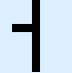</td><td>U+1CE13</td><td>LOWER HALF VERTICAL LINE WITH THREE TICK MARKS</td></tr>
<tr><td>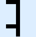</td><td>U+1CE14</td><td>UPPER HALF VERTICAL LINE WITH THREE TICK MARKS</td></tr>
<tr><td>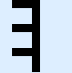</td><td>U+1CE15</td><td>VERTICAL LINE WITH THREE TICK MARKS</td></tr>
<tr><td></td><td>U+1CE16</td><td>BOX DRAWINGS LIGHT VERTICAL AND TOP RIGHT</td></tr>
<tr><td></td><td>U+1CE17</td><td>BOX DRAWINGS LIGHT VERTICAL AND BOTTOM RIGHT</td></tr>
<tr><td></td><td>U+1CE18</td><td>BOX DRAWINGS LIGHT VERTICAL AND TOP LEFT</td></tr>
<tr><td></td><td>U+1CE19</td><td>BOX DRAWINGS LIGHT VERTICAL AND BOTTOM LEFT</td></tr>
<tr><td></td><td>U+1CE1A</td><td>LARGE TYPE PIECE UPPER LEFT ARC</td></tr>
<tr><td></td><td>U+1CE1B</td><td>LARGE TYPE PIECE UPPER LEFT CORNER</td></tr>
<tr><td></td><td>U+1CE1C</td><td>LARGE TYPE PIECE UPPER TERMINAL</td></tr>
<tr><td></td><td>U+1CE1D</td><td>LARGE TYPE PIECE UPPER LEFT CROTCH</td></tr>
<tr><td></td><td>U+1CE1E</td><td>LARGE TYPE PIECE LEFT ARM</td></tr>
<tr><td></td><td>U+1CE1F</td><td>LARGE TYPE PIECE CROSSBAR</td></tr>
<tr><td></td><td>U+1CE20</td><td>LARGE TYPE PIECE CROSSBAR WITH LOWER STEM</td></tr>
<tr><td></td><td>U+1CE21</td><td>LARGE TYPE PIECE UPPER HALF VERTEX OF M</td></tr>
<tr><td></td><td>U+1CE22</td><td>LARGE TYPE PIECE DIAGONAL LOWER LEFT</td></tr>
<tr><td></td><td>U+1CE23</td><td>LARGE TYPE PIECE SHORT UPPER TERMINAL</td></tr>
<tr><td></td><td>U+1CE24</td><td>LARGE TYPE PIECE UPPER RIGHT ARC</td></tr>
<tr><td></td><td>U+1CE25</td><td>LARGE TYPE PIECE RIGHT ARM</td></tr>
<tr><td></td><td>U+1CE26</td><td>LARGE TYPE PIECE UPPER RIGHT CROTCH</td></tr>
<tr><td></td><td>U+1CE27</td><td>LARGE TYPE PIECE UPPER RIGHT CORNER</td></tr>
<tr><td></td><td>U+1CE28</td><td>LARGE TYPE PIECE STEM WITH RIGHT CROSSBAR</td></tr>
<tr><td></td><td>U+1CE29</td><td>LARGE TYPE PIECE STEM</td></tr>
<tr><td></td><td>U+1CE2A</td><td>LARGE TYPE PIECE DIAGONAL UPPER RIGHT AND LOWER RIGHT</td></tr>
<tr><td></td><td>U+1CE2B</td><td>LARGE TYPE PIECE DIAGONAL UPPER RIGHT</td></tr>
<tr><td></td><td>U+1CE2C</td><td>LARGE TYPE PIECE DIAGONAL LOWER RIGHT</td></tr>
<tr><td></td><td>U+1CE2D</td><td>LARGE TYPE PIECE SHORT LOWER TERMINAL</td></tr>
<tr><td></td><td>U+1CE2E</td><td>LARGE TYPE PIECE LOWER LEFT AND UPPER LEFT ARC</td></tr>
<tr><td></td><td>U+1CE2F</td><td>LARGE TYPE PIECE CENTRE OF K</td></tr>
<tr><td></td><td>U+1CE30</td><td>LARGE TYPE PIECE LOWER HALF VERTEX OF M</td></tr>
<tr><td></td><td>U+1CE31</td><td>LARGE TYPE PIECE UPPER HALF VERTEX OF W</td></tr>
<tr><td></td><td>U+1CE32</td><td>LARGE TYPE PIECE CENTRE OF X</td></tr>
<tr><td></td><td>U+1CE33</td><td>LARGE TYPE PIECE CENTRE OF Y</td></tr>
<tr><td></td><td>U+1CE34</td><td>LARGE TYPE PIECE CENTRE OF Z WITH CROSSBAR</td></tr>
<tr><td></td><td>U+1CE35</td><td>LARGE TYPE PIECE RAISED UPPER RIGHT ARC</td></tr>
<tr><td></td><td>U+1CE36</td><td>LARGE TYPE PIECE STEM WITH LEFT CROSSBAR</td></tr>
<tr><td></td><td>U+1CE37</td><td>LARGE TYPE PIECE LOWER RIGHT AND UPPER RIGHT ARC</td></tr>
<tr><td></td><td>U+1CE38</td><td>LARGE TYPE PIECE DIAGONAL UPPER LEFT AND LOWER LEFT</td></tr>
<tr><td></td><td>U+1CE39</td><td>LARGE TYPE PIECE STEM WITH LEFT JOINT</td></tr>
<tr><td></td><td>U+1CE3A</td><td>LARGE TYPE PIECE STEM WITH CROSSBAR</td></tr>
<tr><td></td><td>U+1CE3B</td><td>LARGE TYPE PIECE DIAGONAL UPPER LEFT</td></tr>
<tr><td></td><td>U+1CE3C</td><td>LARGE TYPE PIECE LOWER TERMINAL</td></tr>
<tr><td></td><td>U+1CE3D</td><td>LARGE TYPE PIECE LOWER LEFT CORNER</td></tr>
<tr><td></td><td>U+1CE3E</td><td>LARGE TYPE PIECE LOWER LEFT ARC</td></tr>
<tr><td></td><td>U+1CE3F</td><td>LARGE TYPE PIECE LOWER LEFT CROTCH</td></tr>
<tr><td></td><td>U+1CE40</td><td>LARGE TYPE PIECE CROSSBAR WITH UPPER STEM</td></tr>
<tr><td></td><td>U+1CE41</td><td>LARGE TYPE PIECE VERTEX OF V</td></tr>
<tr><td></td><td>U+1CE42</td><td>LARGE TYPE PIECE LOWER HALF VERTEX OF W</td></tr>
<tr><td></td><td>U+1CE43</td><td>LARGE TYPE PIECE LOWER RIGHT ARC</td></tr>
<tr><td></td><td>U+1CE44</td><td>LARGE TYPE PIECE LOWER RIGHT CORNER</td></tr>
<tr><td></td><td>U+1CE45</td><td>LARGE TYPE PIECE LOWER RIGHT ARC WITH TAIL</td></tr>
<tr><td></td><td>U+1CE46</td><td>LARGE TYPE PIECE LOWER RIGHT CROTCH</td></tr>
<tr><td></td><td>U+1CE47</td><td>LARGE TYPE PIECE STEM-45</td></tr>
<tr><td></td><td>U+1CE48</td><td>LARGE TYPE PIECE STEM-2345</td></tr>
<tr><td></td><td>U+1CE49</td><td>LARGE TYPE PIECE STEM-4</td></tr>
<tr><td></td><td>U+1CE4A</td><td>LARGE TYPE PIECE STEM-34</td></tr>
<tr><td></td><td>U+1CE4B</td><td>LARGE TYPE PIECE STEM-234</td></tr>
<tr><td></td><td>U+1CE4C</td><td>LARGE TYPE PIECE STEM-1234</td></tr>
<tr><td></td><td>U+1CE4D</td><td>LARGE TYPE PIECE STEM-3</td></tr>
<tr><td></td><td>U+1CE4E</td><td>LARGE TYPE PIECE STEM-23</td></tr>
<tr><td></td><td>U+1CE4F</td><td>LARGE TYPE PIECE STEM-2</td></tr>
<tr><td></td><td>U+1CE50</td><td>LARGE TYPE PIECE STEM-12</td></tr>
<tr><td></td><td>U+1CE51</td><td>SEPARATED BLOCK SEXTANT-1</td></tr>
<tr><td></td><td>U+1CE52</td><td>SEPARATED BLOCK SEXTANT-2</td></tr>
<tr><td></td><td>U+1CE53</td><td>SEPARATED BLOCK SEXTANT-12</td></tr>
<tr><td></td><td>U+1CE54</td><td>SEPARATED BLOCK SEXTANT-3</td></tr>
<tr><td></td><td>U+1CE55</td><td>SEPARATED BLOCK SEXTANT-13</td></tr>
<tr><td></td><td>U+1CE56</td><td>SEPARATED BLOCK SEXTANT-23</td></tr>
<tr><td></td><td>U+1CE57</td><td>SEPARATED BLOCK SEXTANT-123</td></tr>
<tr><td></td><td>U+1CE58</td><td>SEPARATED BLOCK SEXTANT-4</td></tr>
<tr><td></td><td>U+1CE59</td><td>SEPARATED BLOCK SEXTANT-14</td></tr>
<tr><td></td><td>U+1CE5A</td><td>SEPARATED BLOCK SEXTANT-24</td></tr>
<tr><td></td><td>U+1CE5B</td><td>SEPARATED BLOCK SEXTANT-124</td></tr>
<tr><td></td><td>U+1CE5C</td><td>SEPARATED BLOCK SEXTANT-34</td></tr>
<tr><td></td><td>U+1CE5D</td><td>SEPARATED BLOCK SEXTANT-134</td></tr>
<tr><td></td><td>U+1CE5E</td><td>SEPARATED BLOCK SEXTANT-234</td></tr>
<tr><td></td><td>U+1CE5F</td><td>SEPARATED BLOCK SEXTANT-1234</td></tr>
<tr><td></td><td>U+1CE60</td><td>SEPARATED BLOCK SEXTANT-5</td></tr>
<tr><td></td><td>U+1CE61</td><td>SEPARATED BLOCK SEXTANT-15</td></tr>
<tr><td></td><td>U+1CE62</td><td>SEPARATED BLOCK SEXTANT-25</td></tr>
<tr><td></td><td>U+1CE63</td><td>SEPARATED BLOCK SEXTANT-125</td></tr>
<tr><td></td><td>U+1CE64</td><td>SEPARATED BLOCK SEXTANT-35</td></tr>
<tr><td></td><td>U+1CE65</td><td>SEPARATED BLOCK SEXTANT-135</td></tr>
<tr><td></td><td>U+1CE66</td><td>SEPARATED BLOCK SEXTANT-235</td></tr>
<tr><td></td><td>U+1CE67</td><td>SEPARATED BLOCK SEXTANT-1235</td></tr>
<tr><td></td><td>U+1CE68</td><td>SEPARATED BLOCK SEXTANT-45</td></tr>
<tr><td></td><td>U+1CE69</td><td>SEPARATED BLOCK SEXTANT-145</td></tr>
<tr><td></td><td>U+1CE6A</td><td>SEPARATED BLOCK SEXTANT-245</td></tr>
<tr><td></td><td>U+1CE6B</td><td>SEPARATED BLOCK SEXTANT-1245</td></tr>
<tr><td></td><td>U+1CE6C</td><td>SEPARATED BLOCK SEXTANT-345</td></tr>
<tr><td></td><td>U+1CE6D</td><td>SEPARATED BLOCK SEXTANT-1345</td></tr>
<tr><td></td><td>U+1CE6E</td><td>SEPARATED BLOCK SEXTANT-2345</td></tr>
<tr><td></td><td>U+1CE6F</td><td>SEPARATED BLOCK SEXTANT-12345</td></tr>
<tr><td></td><td>U+1CE70</td><td>SEPARATED BLOCK SEXTANT-6</td></tr>
<tr><td></td><td>U+1CE71</td><td>SEPARATED BLOCK SEXTANT-16</td></tr>
<tr><td></td><td>U+1CE72</td><td>SEPARATED BLOCK SEXTANT-26</td></tr>
<tr><td></td><td>U+1CE73</td><td>SEPARATED BLOCK SEXTANT-126</td></tr>
<tr><td></td><td>U+1CE74</td><td>SEPARATED BLOCK SEXTANT-36</td></tr>
<tr><td></td><td>U+1CE75</td><td>SEPARATED BLOCK SEXTANT-136</td></tr>
<tr><td></td><td>U+1CE76</td><td>SEPARATED BLOCK SEXTANT-236</td></tr>
<tr><td></td><td>U+1CE77</td><td>SEPARATED BLOCK SEXTANT-1236</td></tr>
<tr><td></td><td>U+1CE78</td><td>SEPARATED BLOCK SEXTANT-46</td></tr>
<tr><td></td><td>U+1CE79</td><td>SEPARATED BLOCK SEXTANT-146</td></tr>
<tr><td></td><td>U+1CE7A</td><td>SEPARATED BLOCK SEXTANT-246</td></tr>
<tr><td></td><td>U+1CE7B</td><td>SEPARATED BLOCK SEXTANT-1246</td></tr>
<tr><td></td><td>U+1CE7C</td><td>SEPARATED BLOCK SEXTANT-346</td></tr>
<tr><td></td><td>U+1CE7D</td><td>SEPARATED BLOCK SEXTANT-1346</td></tr>
<tr><td></td><td>U+1CE7E</td><td>SEPARATED BLOCK SEXTANT-2346</td></tr>
<tr><td></td><td>U+1CE7F</td><td>SEPARATED BLOCK SEXTANT-12346</td></tr>
<tr><td></td><td>U+1CE80</td><td>SEPARATED BLOCK SEXTANT-56</td></tr>
<tr><td></td><td>U+1CE81</td><td>SEPARATED BLOCK SEXTANT-156</td></tr>
<tr><td></td><td>U+1CE82</td><td>SEPARATED BLOCK SEXTANT-256</td></tr>
<tr><td></td><td>U+1CE83</td><td>SEPARATED BLOCK SEXTANT-1256</td></tr>
<tr><td></td><td>U+1CE84</td><td>SEPARATED BLOCK SEXTANT-356</td></tr>
<tr><td></td><td>U+1CE85</td><td>SEPARATED BLOCK SEXTANT-1356</td></tr>
<tr><td></td><td>U+1CE86</td><td>SEPARATED BLOCK SEXTANT-2356</td></tr>
<tr><td></td><td>U+1CE87</td><td>SEPARATED BLOCK SEXTANT-12356</td></tr>
<tr><td></td><td>U+1CE88</td><td>SEPARATED BLOCK SEXTANT-456</td></tr>
<tr><td></td><td>U+1CE89</td><td>SEPARATED BLOCK SEXTANT-1456</td></tr>
<tr><td></td><td>U+1CE8A</td><td>SEPARATED BLOCK SEXTANT-2456</td></tr>
<tr><td></td><td>U+1CE8B</td><td>SEPARATED BLOCK SEXTANT-12456</td></tr>
<tr><td></td><td>U+1CE8C</td><td>SEPARATED BLOCK SEXTANT-3456</td></tr>
<tr><td></td><td>U+1CE8D</td><td>SEPARATED BLOCK SEXTANT-13456</td></tr>
<tr><td></td><td>U+1CE8E</td><td>SEPARATED BLOCK SEXTANT-23456</td></tr>
<tr><td></td><td>U+1CE8F</td><td>SEPARATED BLOCK SEXTANT-123456</td></tr>
<tr><td></td><td>U+1CE90</td><td>UPPER LEFT ONE SIXTEENTH BLOCK</td></tr>
<tr><td></td><td>U+1CE91</td><td>UPPER CENTRE LEFT ONE SIXTEENTH BLOCK</td></tr>
<tr><td></td><td>U+1CE92</td><td>UPPER CENTRE RIGHT ONE SIXTEENTH BLOCK</td></tr>
<tr><td></td><td>U+1CE93</td><td>UPPER RIGHT ONE SIXTEENTH BLOCK</td></tr>
<tr><td></td><td>U+1CE94</td><td>UPPER MIDDLE LEFT ONE SIXTEENTH BLOCK</td></tr>
<tr><td></td><td>U+1CE95</td><td>UPPER MIDDLE CENTRE LEFT ONE SIXTEENTH BLOCK</td></tr>
<tr><td></td><td>U+1CE96</td><td>UPPER MIDDLE CENTRE RIGHT ONE SIXTEENTH BLOCK</td></tr>
<tr><td></td><td>U+1CE97</td><td>UPPER MIDDLE RIGHT ONE SIXTEENTH BLOCK</td></tr>
<tr><td></td><td>U+1CE98</td><td>LOWER MIDDLE LEFT ONE SIXTEENTH BLOCK</td></tr>
<tr><td></td><td>U+1CE99</td><td>LOWER MIDDLE CENTRE LEFT ONE SIXTEENTH BLOCK</td></tr>
<tr><td></td><td>U+1CE9A</td><td>LOWER MIDDLE CENTRE RIGHT ONE SIXTEENTH BLOCK</td></tr>
<tr><td></td><td>U+1CE9B</td><td>LOWER MIDDLE RIGHT ONE SIXTEENTH BLOCK</td></tr>
<tr><td></td><td>U+1CE9C</td><td>LOWER LEFT ONE SIXTEENTH BLOCK</td></tr>
<tr><td></td><td>U+1CE9D</td><td>LOWER CENTRE LEFT ONE SIXTEENTH BLOCK</td></tr>
<tr><td></td><td>U+1CE9E</td><td>LOWER CENTRE RIGHT ONE SIXTEENTH BLOCK</td></tr>
<tr><td></td><td>U+1CE9F</td><td>LOWER RIGHT ONE SIXTEENTH BLOCK</td></tr>
<tr><td></td><td>U+1CEA0</td><td>RIGHT HALF LOWER ONE QUARTER BLOCK</td></tr>
<tr><td></td><td>U+1CEA1</td><td>RIGHT THREE QUARTERS LOWER ONE QUARTER BLOCK</td></tr>
<tr><td></td><td>U+1CEA2</td><td>LEFT THREE QUARTERS LOWER ONE QUARTER BLOCK</td></tr>
<tr><td></td><td>U+1CEA3</td><td>LEFT HALF LOWER ONE QUARTER BLOCK</td></tr>
<tr><td></td><td>U+1CEA4</td><td>LOWER HALF LEFT ONE QUARTER BLOCK</td></tr>
<tr><td></td><td>U+1CEA5</td><td>LOWER THREE QUARTERS LEFT ONE QUARTER BLOCK</td></tr>
<tr><td></td><td>U+1CEA6</td><td>UPPER THREE QUARTERS LEFT ONE QUARTER BLOCK</td></tr>
<tr><td></td><td>U+1CEA7</td><td>UPPER HALF LEFT ONE QUARTER BLOCK</td></tr>
<tr><td></td><td>U+1CEA8</td><td>LEFT HALF UPPER ONE QUARTER BLOCK</td></tr>
<tr><td></td><td>U+1CEA9</td><td>LEFT THREE QUARTERS UPPER ONE QUARTER BLOCK</td></tr>
<tr><td></td><td>U+1CEAA</td><td>RIGHT THREE QUARTERS UPPER ONE QUARTER BLOCK</td></tr>
<tr><td></td><td>U+1CEAB</td><td>RIGHT HALF UPPER ONE QUARTER BLOCK</td></tr>
<tr><td></td><td>U+1CEAC</td><td>UPPER HALF RIGHT ONE QUARTER BLOCK</td></tr>
<tr><td></td><td>U+1CEAD</td><td>UPPER THREE QUARTERS RIGHT ONE QUARTER BLOCK</td></tr>
<tr><td></td><td>U+1CEAE</td><td>LOWER THREE QUARTERS RIGHT ONE QUARTER BLOCK</td></tr>
<tr><td></td><td>U+1CEAF</td><td>LOWER HALF RIGHT ONE QUARTER BLOCK</td></tr>
</table>
